# ADORB TEST MODEL COMPARISON:

Below is a comparison of two EnergyPlus simulations: one simulation using the [KMR Example model](https://github.com/Phius-ResearchComittee/REVIVE/releases/tag/v24.2.0) provided by Phius, run using their Phius-REVIVE GUI tool, and another using a [Honeybee-REVIVE model](https://github.com/PH-Tools/honeybee_REVIVE_grasshopper/blob/main/tests/phius_rv2024_model.hbjson) which was built to match the KMR example as closely as possible using Honeybee Grasshopper methods and components. The test model is a single-zone, single-family home. The home includes a below-grade basement, as well as two on-grade floor surfaces ("Crawlspace" and "Slab"):

# METHODOLOGY:
Using the [Honeybee-REVIVE toolkit](https://github.com/PH-Tools/honeybee_REVIVE_grasshopper/tree/main), a complete Honeybee-REVIVE model was constructed in Rhino/Grasshopper with attributes which align to the Phius KMR Example file as closely as possible (see below for a discussion of the known discrepancies). A full annual simulation was executed for both simulations, and the ADORB costs calculated based on the simulation results. ADORB costs for the Phius-case were calculated using their Phius-GUI tool, while the HB-REVIVE case uses the new [PH-ADORB library](https://github.com/PH-Tools/PH_ADORB).

### MODEL FILES:
Relevant model files can be found at:
- [EPW File: Rochester, MN]()
- - -
- [Phius GUI Generated IDF](https://github.com/PH-Tools/honeybee_REVIVE_grasshopper/tree/main/tests/adorb/phius_gui)
- [Phius GUI Generated Results](https://github.com/PH-Tools/honeybee_REVIVE_grasshopper/tree/main/tests/adorb/phius_gui/results)
- - - 
- [Grasshopper Model Generation Script](https://github.com/PH-Tools/honeybee_REVIVE_grasshopper/blob/main/tests/phius_rv2024_model.gh)
- [Grasshopper Simulation Run Script](https://github.com/PH-Tools/honeybee_REVIVE_grasshopper/blob/main/tests/phius_rv2024_simulate_ADORB.gh)
- [Honeybee-REVIVE Model Results](https://github.com/PH-Tools/honeybee_REVIVE_grasshopper/blob/main/tests/adorb/hbrv/hb_revive_ADORB_results)

### KNOWN MODEL DIFFERENCES:
There are four key discrepancies found between the Honeybee-REVIVE model and the Phius-GUI model which have been identified during this comparison:
1. **Kiva:** The Phius GUI utilizes the [KIVA ground solver](https://kiva.readthedocs.io/en/stable/), while the Honeybee model does not. This feature is not currently supported by Honeybee. For the purposes of this evaluation, a temporary 'patch' was applied to the Honeybee model in order to enable KIVA in both simulations. In the long term, Honeybee would need to provide feature support for KIVA in order to allow alignment with the REVIVE protocol. While there does not appear to be significant difference when the model uses well insulated surfaces, for models which have un- or poorly-insulated ground-contact surfaces (typical of many existing homes) there does appear to a large difference in modeled performance when Kiva is used.
1. **Mechanical Equipment:** The Phius-GUI tool uses 'hard-coded' mechanical equipment for a [selection of different types](https://github.com/Phius-ResearchComittee/REVIVE/blob/5ddd9cc7f55639071ac35f9b1701c286b68b1ca6/REVIVE2024/hvac.py#L106) common in smaller residential buildings. By contrast, the Honeybee-REVIVE model is restricted to only the mechanical systems available through [NREL's OpenStudio Standards templates.](https://github.com/NREL/openstudio-standards) While these templates are quite comprehensive, they do not have an option that matches the Phius-GUI system perfectly, and so there is some inevitable discrepancy between the model's mechanical equipment.   
*Note: while it does appear possible to configure a detailed system for the Honeybee-REVIVE model using the [IronBug](https://github.com/MingboPeng/Ironbug) plugin, this plugin is not currently available for MacOS or Windows-ARM systems and so was not tested as part of this validation testing. Further testing on a Windows-OS may show better alignment between systems if IronBug is used.*  
1. **Envelope Infiltration Parameters:** While both models have the same infiltration flow-rate, the Phius-GUI and Honeybee set different attributes for the `Temperature Term Coefficient` and `Velocity Term Coefficient` values in the EnergyPlus IDF `ZoneInfiltration:DesignFlowRate` object. For purposes of this study, the Honeybee-REVIVE IDF values were patched to match the Phius-GUI settings in order to align the simulation results. 
1. **Maintenance and Replacement Cost:** There appears to be an error [in the Phius-GUI code](https://github.com/Phius-ResearchComittee/REVIVE/blob/5ddd9cc7f55639071ac35f9b1701c286b68b1ca6/REVIVE2024/simulate.py#L1067) which causes all model construction material costs to be duplicated on year 1, leading to an erroneously high ADORB cost. The error is fixed in the Honeybee-REVIVE implementation, and as a result the maintenance and replacement ADORB cost is 50% lower in the Honeybee-REVIVE case.

# ENERGYPLUS SIMULATION RESULTS:

<strong>Site Outdoor Conditions:</strong>

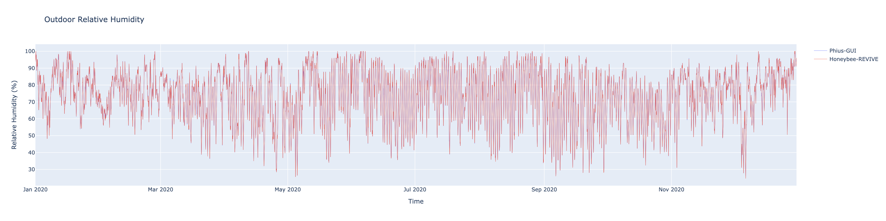

<strong>Zone Indoor Conditions:</strong>

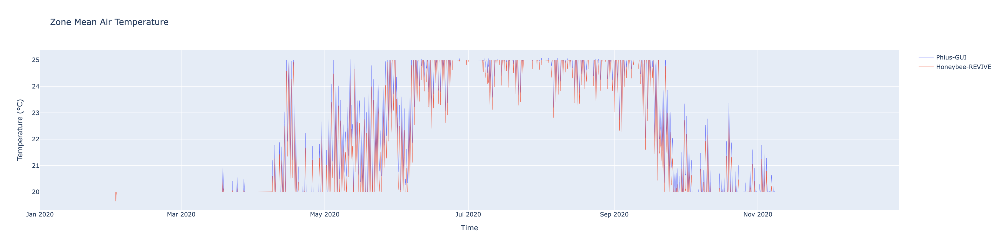
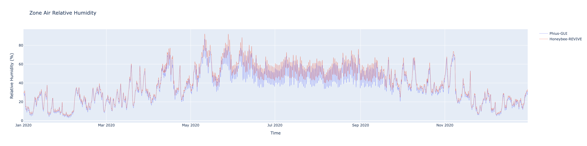

<strong>Zone Internal Gains:</strong>

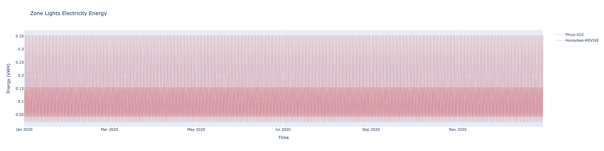

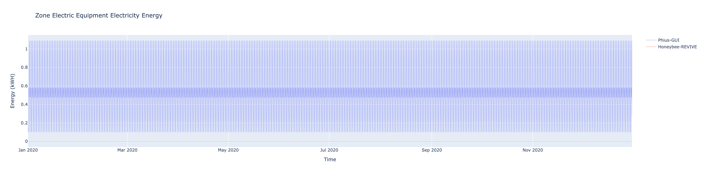

<strong>Zone Ventilation Airflows:</strong>

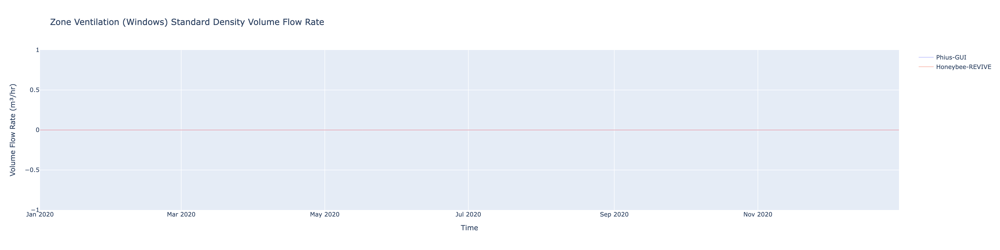

  

# ADORB COST RESULTS:
Below is a summary of the ADORB cost values calculated for both the Phius-GUI model as well as the Honeybee-REVIVE model. 

## Operational Energy Purchase PV-Cost:
These costs represent the present-value of future net energy purchasing costs. 

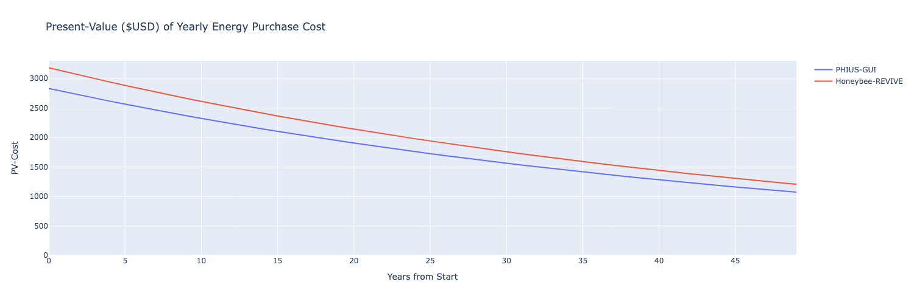

## Operational Energy CO2 PV-Cost:
These costs represent the present-value of CO2-emissions costs of all future net energy consumption.

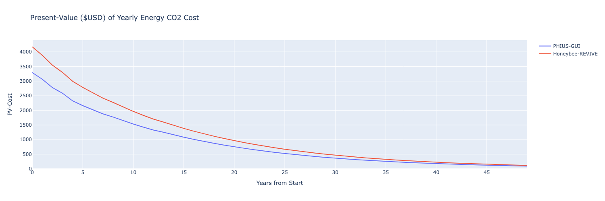

## Construction Measure Purchase PV-Cost:
These costs represent the present-value of all 'construction' related expenses including all relevant materials, equipment, products, and other 'measures' which are taken during the life of the building which affect the carbon-emissions and the out-of-pocket costs. These costs include all first-costs associated with the acquisition (material) and installation (labor) as well as all recurring maintenance and replacement costs.

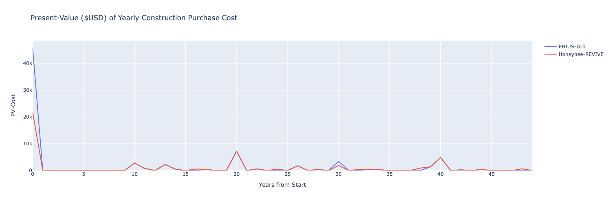

## Construction Measure CO2 PV-Cost:
These cost represent the present-value of all 'construction' related embodied CO2 emissions costs. This includes all ongoing maintenance and replacement costs. 

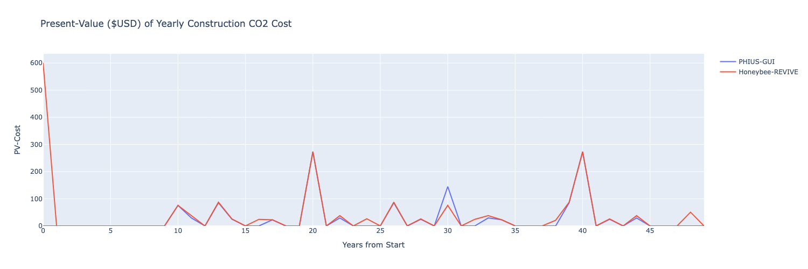

## Grid Transition PV-Cost:
These costs represent the present-value of a recurring 'grid-transition' fee which covers the increased electrical load the building represents.

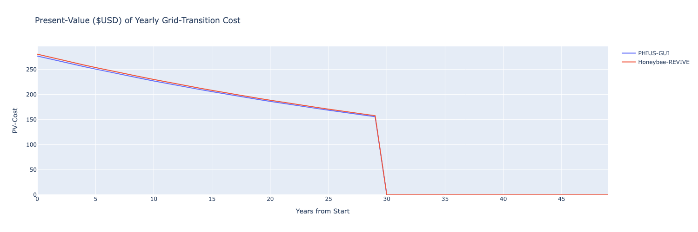

## Total Cumulative ADORB Cost:
Looking at the total Cumulative ADORB costs over the analysis period

